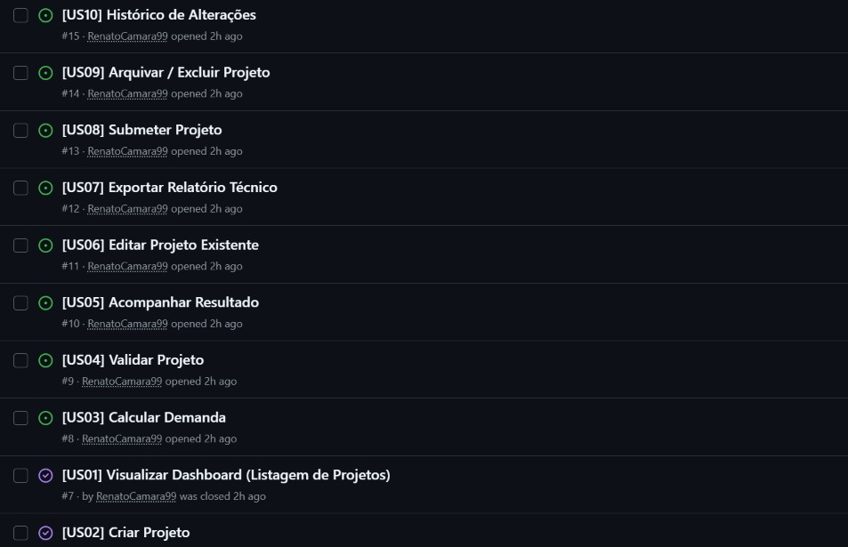

# NeoDemanda — Back-end

Sistema de cálculo de demanda elétrica para múltiplas unidades consumidoras,
desenvolvido para o Desafio Neoenergia Pernambuco.

## POO - Entrega 01

* **Histórias de Usuário (BDD):** [Acessar documento de histórias](./USER_STORIES.md)
* **Protótipo Lo-Fi (Figma):** [Acessar protótipo no Figma](https://www.figma.com/board/onKTrKXokheee44mOtn8tY/Semana-3?node-id=0-1&p=f&t=CaoYtOBM9zOhoPS2-0)
* **Vídeo de Apresentação:** [Assistir Screencast no YouTube](https://youtu.be/gqlp-GMIjDs?si=1Zo3gzDpE2A21enm)
API REST para **automação do cálculo normativo de demanda elétrica** da Neoenergia PE.


Este repositório contém a estrutura base do back-end, preparada para receber as
funcionalidades de cálculo normativo. No momento expõe apenas um endpoint de
health-check, usado para validar que a aplicação está operante.

## POO - Entrega 02

### Histórias Implementadas

Nesta entrega, foram implementadas as funcionalidades do back-end para viabilizar o fluxo básico de cadastro e visualização de projetos elétricos, utilizando contratos REST documentados via OpenAPI/Swagger.

#### [US02] Criar Projeto
* **Como** projetista
* **Quero** cadastrar um novo projeto informando cliente, tipo, potência e quantidade de unidades
* **Para que** eu possa iniciar estruturadamente o processo de análise de uma nova demanda elétrica.

**Critérios de Aceite (BDD):**
* **Dado** que o projetista se encontra no dashboard ou cliente de requisições
* **Quando** ele envia uma requisição `POST /projetos` com os dados obrigatórios preenchidos (`nomeProjeto`, `responsavelTecnico`, `creaResponsavel`, `quantidadeUnidadesConsumidoras`, `cargaInstaladaKva` e `tipoEdificacao`)
* **Então** o sistema valida o corpo da requisição, cria o registro com status inicial `RASCUNHO` e retorna o código HTTP `201 Created` contendo o ID gerado.

---

#### [US01] Visualizar Dashboard (Listagem de Projetos)
* **Como** projetista
* **Quero** visualizar meus projetos e seus status em um painel/dashboard
* **Para que** eu possa acompanhar rapidamente o andamento e o volume das demandas ativas.

**Critérios de Aceite (BDD):**
* **Dado** que existem projetos cadastrados na aplicação
* **Quando** o usuário realiza uma requisição `GET /projetos`
* **Então** o sistema retorna o código HTTP `200 OK` contendo a listagem atualizada de todos os projetos salvos e seus respectivos status[cite: 8].

---

### Issue / Bug Tracker

O acompanhamento das tarefas e do ciclo de vida das histórias de usuário desta entrega foi gerenciado diretamente pelo GitHub Issues[cite: 17].



### Screencasts da Aplicação

Os vídeos de demonstração e de detalhamento técnico foram disponibilizados no YouTube conforme as diretrizes da entrega[cite: 17]:

1. **Uso do Sistema (Aplicação Spring Boot rodando via Swagger UI):**  
   * Link: [Assistir no YouTube](https://youtu.be/xYEddJ1rLeY)

2. **Explicação do Código Spring Boot e Decisões de Arquitetura:**  
   * Link: [Assistir no YouTube](https://youtu.be/Q07nLVtD03o)

---

### Decisão Arquitetural: Persistência Temporária (H2 / Memória)

Para a Entrega 02, optou-se pela utilização do banco H2 em memória e estruturas thread-safe[cite: 17]. Os principais fatores para essa decisão foram:
* **Foco nos Contratos da API:** Priorizar a correta modelagem dos DTOs, validações com Bean Validation e documentação interativa com Swagger/OpenAPI[cite: 3, 17].
* **Zero Setup:** Permitir que qualquer membro da equipe ou avaliador execute o projeto de forma autônoma e imediata sem dependência de instalação e configuração de instâncias externas de banco de dados.
* **Transparência para o Banco Relacional:** A aplicação já foi desacoplada utilizando abstrações do Spring Data JPA, garantindo que a migração futura para um banco SQL em produção (como PostgreSQL ou MySQL) ocorra apenas com ajustes de propriedades e drivers, preservando a lógica de negócio dos Controllers e Services.

## Stack

| Item | Versão / Tecnologia |
| --- | --- |
| Linguagem | Java 25 (LTS) |
| Framework | Spring Boot 4.1.1 |
| Web | `spring-boot-starter-webmvc` (Spring MVC + Tomcat embarcado) |
| Validação | `spring-boot-starter-validation` (Jakarta Bean Validation + Hibernate Validator) |
| Dev | `spring-boot-devtools` (restart automático) |
| Testes | `spring-boot-starter-test` (JUnit 5 + Mockito + AssertJ) |
| Build | Maven (via Maven Wrapper — `mvnw`) |

## Pré-requisitos

- **JDK 25** instalado e `JAVA_HOME` apontando para ele.
- Maven **não** precisa ser instalado: o projeto usa o Maven Wrapper (`mvnw` / `mvnw.cmd`),
  que baixa a versão correta do Maven automaticamente na primeira execução.

Verifique a instalação:

```bash
java -version
```

## Como executar localmente

Clone o repositório e, na raiz do projeto:

**Linux / macOS / Git Bash**

```bash
./mvnw spring-boot:run
```

**Windows (PowerShell / CMD)**

```powershell
.\mvnw.cmd spring-boot:run
```

A aplicação sobe em `http://localhost:8080`.

### Gerar e executar o JAR

```bash
./mvnw clean package
java -jar target/neodemanda-0.0.1-SNAPSHOT.jar
```

### Executar os testes

```bash
./mvnw test
```

## Endpoints

| Método | Rota | Descrição | Resposta |
| --- | --- | --- | --- |
| `GET` | `/health` | Health-check da API | `200 OK` — `{"status":"ok"}` |

Exemplo:

```bash
curl http://localhost:8080/health
```

```json
{"status":"ok"}
```

## Estrutura de pacotes

Todo o código-fonte fica sob `com.neoenergia.neodemanda`:

```
src/main/java/com/neoenergia/neodemanda/
├── NeodemandaApplication.java   # classe principal (ponto de entrada)
├── controller/                  # camada REST — endpoints HTTP
├── service/                     # regras de negócio (cálculo normativo)
├── repository/                  # acesso a dados / persistência
├── model/                       # entidades e objetos de domínio
├── dto/                         # objetos de entrada e saída da API (Bean Validation)
└── exception/                   # exceções e tratamento centralizado de erros
```

Os testes espelham essa estrutura em `src/test/java/com/neoenergia/neodemanda/`.

## Configuração

Parâmetros da aplicação ficam em [`src/main/resources/application.properties`](src/main/resources/application.properties).
A porta padrão é a `8080` e pode ser alterada por `server.port`.

## Tratamento de erros

`GlobalExceptionHandler` traduz as violações de Bean Validation e os recursos não
encontrados para um corpo JSON único (`ApiError`). Exceções não mapeadas seguem
para o tratamento padrão do Spring Boot, preservando os status do framework
(ex.: `404` para rotas inexistentes).

```json
{
  "timestamp": "2026-09-03T21:30:00.000-03:00",
  "status": 400,
  "error": "Bad Request",
  "message": "Erro de validacao nos dados enviados",
  "path": "/exemplo",
  "fields": {
    "campo": "não deve ser nulo"
  }
}
```

O campo `fields` vem vazio (`{}`) em erros que não são de validação.
